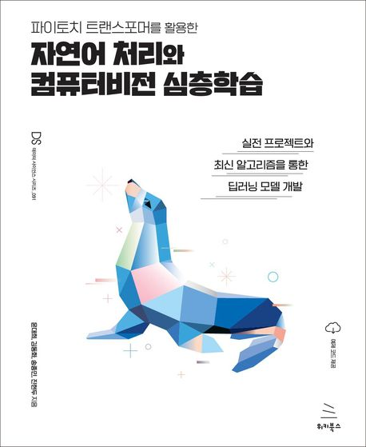

# 파이토치 트랜스포머를 활용한 자연어 처리와 컴퓨터비전 심층학습

    

- 위키북스 네이버 카페 - [파이토치 & 딥러닝 온라인 스터디 1기 공지](https://cafe.naver.com/wikibookstudy/1533)
- 스케줄

    

- 도서 정보
  - 파이토치 트랜스포머를 활용한 자연어 처리와 컴퓨터비전 심층학습 - 실전 프로젝트와 최신 알고리즘을 통한 딥러닝 모델 개발
  - 위키북스 데이터 사이언스 시리즈 91
  - 윤대희, 김동화, 송종민, 진현두
  - 위키북스
  - 2023년 10월 18일